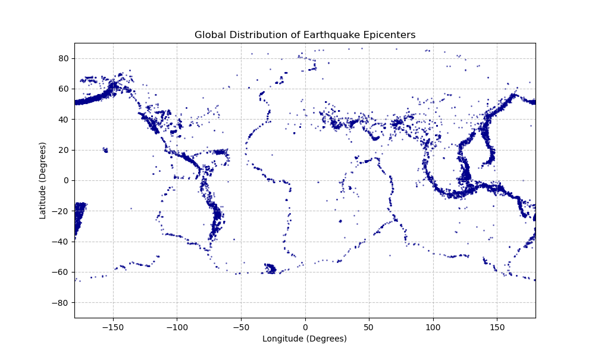

# Earthquake Data Analysis

Static previews now live in the repository so GitHub renders the key figures without needing to run the notebook. The interactive map export is also checked in for local exploration.

## Files
- `earthquake_analysis_main.ipynb`: main analysis and write-up.
- `setup_libs.py`: helper imports and plotting defaults used by the notebook.
- `earthquake_dataset.csv`, `plate_boundaries.csv`: source data.
- `export_epicentre_map.py`: recreates the Section 8.2 assets (HTML map, PNG preview, region summary CSV).
- `epicentre_map_section8_2.html`: interactive Plotly map; open locally in a browser.
- `epicentre_map_section8_2.png`, `epicentre_scatter.png`: static previews for GitHub viewing.
- `region_summary_section8_2.csv`, `world_map.png`: supporting exports/assets.

## Quick start
- Install Python 3.9+ with `pandas`, `numpy`, `matplotlib`, `seaborn`, `plotly`, `scikit-learn`, and `scipy` (the script handles missing optional libs gracefully).
- Open `earthquake_analysis_main.ipynb` in Jupyter or VS Code to read or re-run the analysis.
- Regenerate the map outputs from the repo root:

```powershell
python export_epicentre_map.py
```

This rewrites `epicentre_map_section8_2.png`, `epicentre_map_section8_2.html`, and `region_summary_section8_2.csv`.

## Interactive map (Section 8.2)
- Open the live map in your browser via the raw HTML: [epicentre_map_section8_2.html](https://raw.githubusercontent.com/DanPenso/earthquake-data-analysis/main/earthquake-data-analysis/epicentre_map_section8_2.html).
- If the link shows raw code, choose "Save link as..." and open the downloaded file locally to get full pan/zoom/hover interactivity.
- Rerun `python export_epicentre_map.py` to refresh the HTML/PNG/CSV after regenerating the analysis.

## Visual previews



## Notes
- GitHub will not render the HTML map inline; download `epicentre_map_section8_2.html` to explore the interactive version.
- The static PNGs above live alongside the notebook so they display correctly in GitHub and in the notebook markdown.
